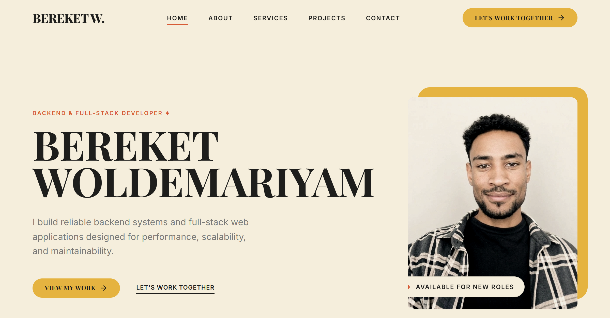

# Bereket Woldemariyam — Full Stack Web Developer

Welcome to my personal developer portfolio. I am a Backend and Full-Stack Web Developer specializing in building robust server-side applications, designing complex databases, and crafting seamless APIs.

This portfolio is built to reflect a clean engineering mindset through a minimal, editorial, and highly performant frontend.

## Portfolio Preview



## About

This project is my central professional presence on the web. It highlights my technical focus, approach to problem-solving, and showcases real-world systems I've built. My development philosophy bridges the gap between raw data processing and exceptional user experiences—engineering solutions that are secure, scalable, and maintainable.

## Featured Projects

### 1. FINDLY — Lost & Found Platform
A full-stack application designed to connect users who have lost or found items.
* **Category:** Full Stack
* **Technologies:** Node.js, Express, MongoDB, EJS, Passport.js
* **Features:** User authentication, Lost item reporting, Search and filtering, Image uploads
* **Links:** [Live Demo](https://findly-self.vercel.app) | [Source Code](https://github.com/bereket2114/Findly)

### 2. TASKFLOW — Productivity Engine
A backend engineering project providing comprehensive task management capabilities.
* **Category:** Backend
* **Technologies:** Node.js, Express, REST API, JWT, MongoDB
* **Features:** Task management APIs, User auth, Role-based access, Analytics endpoints
* **Links:** [Live Demo](https://task-flow-ruddy-zeta.vercel.app) | [Source Code](https://github.com/bereket2114/TaskFlow)

### 3. AA CAR RENTAL — Booking System
A complete vehicle reservation platform and admin dashboard.
* **Category:** Full Stack
* **Technologies:** Node.js, EJS, MongoDB, CSS
* **Features:** Car browsing, Booking engine, Admin dashboard, Payment integration placeholder
* **Links:** [Live Demo](https://car-rental-three-iota.vercel.app) | [Source Code](https://github.com/bereket2114/AA-Car-Rental)

## Services

I offer specialized development services focusing on architecture and integration:

* **API Architecture:** Research-driven REST API designs that define data flow and ensure security.
* **Database Design:** Memorable NoSQL/SQL database schemas designed to scale effortlessly.
* **Full Stack Dev:** Flexible web systems combining robust backend logic with clean frontend rendering.
* **System Integration:** Bold, thoughtful integrations bridging third-party services.

## Technologies Used

* **Frontend Framework:** React 19, TypeScript
* **Build Tool:** Vite
* **Styling:** Custom CSS (Vanilla CSS, CSS Grid/Flexbox)
* **Icons:** Lucide React
* **Linting:** Oxlint

*(Note: The projects showcased in the portfolio utilize Node.js, Express, and MongoDB extensively on the backend).*

## Portfolio Features

* **Responsive Design:** Fluid layout optimized for mobile, tablet, and desktop viewports.
* **Accessible Modals:** Interactive project detail overlays with keyboard-friendly navigation.
* **Dynamic Content Filtering:** Functional category filters (Backend, Full Stack) without page reloads.
* **Custom Interactions:** Smooth animations, custom cursor logic (with touch-device fallbacks), and reduced-motion support.

## Getting Started

To run this portfolio locally:

1. **Clone the repository**
   ```bash
   git clone https://github.com/bereket2114/my-professional-portfolio.git
   cd bereket_portfolio_website
   ```

2. **Install dependencies**
   ```bash
   npm install
   ```

3. **Start the development server**
   ```bash
   npm run dev
   ```

4. **View in browser**
   Open `http://localhost:5173` (or the port provided in your terminal).

## Build

To build the project for production:

```bash
npm run build
```
This will run the TypeScript compiler (`tsc -b`) and generate optimized static assets using Vite (`vite build`) in the `dist/` directory.

## Project Structure

```
├── public/                 # Static assets (images, etc.)
├── src/
│   ├── App.tsx             # Main application component and state logic
│   ├── App.css             # Component-specific styles and media queries
│   ├── index.css           # Global design variables and typography
│   ├── main.tsx            # React root injection
│   └── vite-env.d.ts       # Vite types
├── .oxlintrc.json          # Oxlint configuration
├── package.json            # Dependencies and scripts
├── tsconfig.json           # TypeScript configuration
└── vite.config.ts          # Vite bundler configuration
```

## Contact

* **Email:** bereketwoldemariam369@gmail.com
* **LinkedIn:** [bereket-woldemariyam](https://www.linkedin.com/in/bereket-woldemariyam)
* **GitHub:** [bereket2114](https://github.com/bereket2114)
